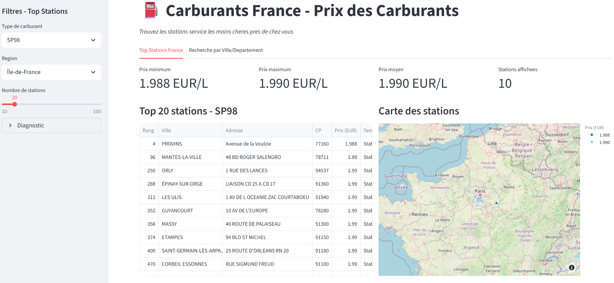
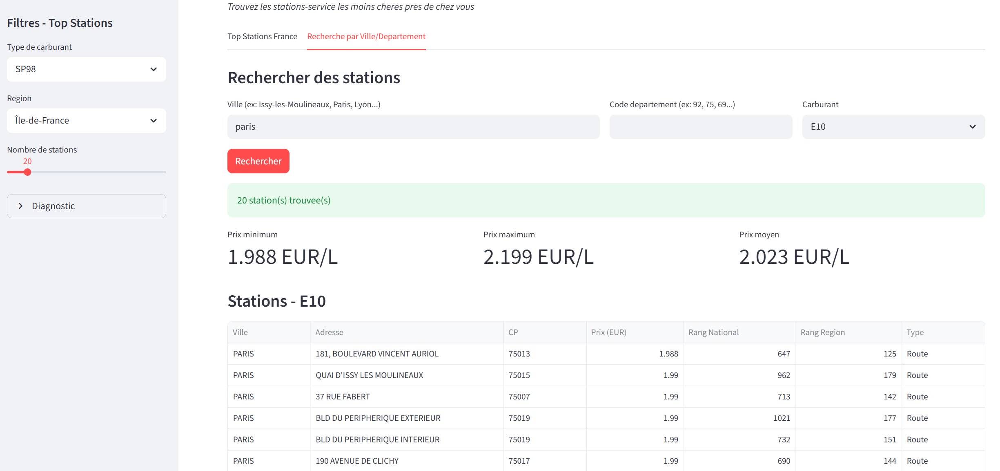

# Carburants France

[](https://carburants-c7q8dfemchmf6yttdwttpv.streamlit.app/)
[](https://www.getdbt.com/)
[](https://www.snowflake.com/)

A data engineering project that analyzes French fuel station prices using a modern data stack: Python ingestion, dbt transformations, Snowflake warehouse, and Streamlit visualization.

## Live Demo

**[View the Dashboard](https://carburants-c7q8dfemchmf6yttdwttpv.streamlit.app/)**

## Project Overview

This project demonstrates a complete end-to-end data pipeline that:

1. **Ingests** real-time fuel price data from the French government's open data API
2. **Transforms** raw XML data into a dimensional model using dbt
3. **Stores** the data in Snowflake with a star schema optimized for analytics
4. **Visualizes** insights through an interactive Streamlit dashboard

### Data Source

The data comes from [data.gouv.fr](https://donnees.roulez-eco.fr/opendata/instantane), France's official open data platform, providing real-time fuel prices for 10,000+ gas stations across the country.

## Architecture

```
                                    CARBURANTS FRANCE ARCHITECTURE
+-------------------------------------------------------------------------------------------+
|                                                                                           |
|   DATA SOURCE                    INGESTION                      TRANSFORMATION            |
|   +-------------+               +-------------+                +------------------+       |
|   |  data.gouv  |    HTTP/XML   |   Python    |    Snowflake   |       dbt        |       |
|   |    .fr      | ------------> |   Script    | -------------> |    Models        |       |
|   | (Fuel API)  |               | (ingest.py) |                |                  |       |
|   +-------------+               +-------------+                +------------------+       |
|                                       |                               |                   |
|                                       v                               v                   |
|                               +-----------------------------------------------+           |
|                               |              SNOWFLAKE WAREHOUSE              |           |
|                               |  +----------+  +-------------+  +----------+  |           |
|                               |  |   RAW    |  | STAGING/INT |  |  MARTS   |  |           |
|                               |  | SCHEMA   |->|   SCHEMAS   |->|  SCHEMA  |  |           |
|                               |  +----------+  +-------------+  +----------+  |           |
|                               +-----------------------------------------------+           |
|                                                      |                                    |
|                                                      v                                    |
|                                            +------------------+                           |
|                                            |    Streamlit     |                           |
|                                            |    Dashboard     |                           |
|                                            | (Hosted on Cloud)|                           |
|                                            +------------------+                           |
|                                                                                           |
+-------------------------------------------------------------------------------------------+
```

## Star Schema

```
                                    DIMENSIONAL MODEL (STAR SCHEMA)

                    +------------------+                    +------------------+
                    |   dim_stations   |                    |   dim_regions    |
                    +------------------+                    +------------------+
                    | station_key (PK) |                    | region_key (PK)  |
                    | station_id       |                    | region_nom       |
                    | ville            |                    | nb_departements  |
                    | adresse          |                    +--------+---------+
                    | code_postal      |                             |
                    | latitude         |                             |
                    | longitude        |         +-------------------+
                    | type_station     |         |
                    | services_list    |         |
                    +--------+---------+         |
                             |                   |
                             |   +---------------------------------+
                             |   |      fct_prix_carburants        |
                             +-->|          (FACT TABLE)           |<--+
                                 +---------------------------------+   |
                                 | prix_key (PK)                   |   |
                                 | station_key (FK) ---------------+   |
                                 | carburant_key (FK) -----------------+
                                 | date_key (FK) ----------------------+
                                 | region_key (FK) --------------------+
                                 | prix_euros                      |   |
                                 | rang_national                   |   |
                                 | rang_region                     |   |
                                 | categorie_prix                  |   |
                                 | tendance_prix                   |   |
                                 +---------------------------------+   |
                                                                       |
                    +------------------+                    +-----------+------+
                    |  dim_carburants  |                    |    dim_date      |
                    +------------------+                    +------------------+
                    | carburant_key(PK)|                    | date_key (PK)    |
                    | carburant_id     |                    | date_day         |
                    | carburant_nom    |                    | day_of_week      |
                    | (GAZOLE, SP95,   |                    | week_of_year     |
                    |  SP98, E10, E85) |                    | month_name       |
                    +------------------+                    +------------------+
```

## Tech Stack

| Layer | Technology | Purpose |
|-------|------------|---------|
| **Data Source** | data.gouv.fr API | Real-time French fuel prices |
| **Ingestion** | Python, Requests | Download and parse XML data |
| **Storage** | Snowflake | Cloud data warehouse |
| **Transformation** | dbt Core | SQL-based data modeling |
| **Visualization** | Streamlit, Plotly | Interactive dashboard |
| **Hosting** | Streamlit Cloud | Dashboard deployment |

## Key Features & Skills Demonstrated

- **Data Engineering**: ETL pipeline from raw XML to analytics-ready tables
- **Data Modeling**: Star schema design with facts and dimensions
- **dbt Best Practices**: Staging, intermediate, and mart layers with tests and documentation
- **SQL Analytics**: Window functions, rankings, price categorization
- **Python**: XML parsing, API integration, Snowflake connector
- **Data Visualization**: Interactive maps, KPIs, filterable tables
- **Cloud Deployment**: Streamlit Cloud with secure secrets management

## Project Structure

```
Carburants/
|-- carburants_dbt/                 # dbt project
|   |-- models/
|   |   |-- staging/                # Raw data cleaning
|   |   |   |-- stg_carburants__stations.sql
|   |   |   |-- stg_carburants__prix.sql
|   |   |   |-- stg_carburants__services.sql
|   |   |   +-- stg_carburants__ruptures.sql
|   |   |-- intermediate/           # Business logic
|   |   |   |-- int_stations_enriched.sql
|   |   |   +-- int_prix_daily_agg.sql
|   |   +-- marts/
|   |       |-- core/               # Dimensional model
|   |       |   |-- dim_stations.sql
|   |       |   |-- dim_carburants.sql
|   |       |   |-- dim_regions.sql
|   |       |   |-- dim_date.sql
|   |       |   +-- fct_prix_carburants.sql
|   |       +-- analytics/          # Reports
|   |           |-- rpt_stations_moins_cheres.sql
|   |           |-- rpt_prix_moyen_region.sql
|   |           +-- rpt_evolution_prix_hebdo.sql
|   |-- scripts/
|   |   +-- ingest_carburants.py    # Data ingestion script
|   +-- dbt_project.yml
|-- streamlit_app/
|   |-- app.py                      # Dashboard application
|   +-- requirements.txt
|-- docs/
|   +-- screenshots/                # Dashboard screenshots
+-- README.md
```

## How to Run Locally

### Prerequisites

- Python 3.9+
- Snowflake account
- dbt Core 1.7+

### 1. Clone the Repository

```bash
git clone https://github.com/fcmdr/Carburants.git
cd Carburants
```

### 2. Set Up Environment Variables

Create a `.env` file with your Snowflake credentials:

```env
SNOWFLAKE_ACCOUNT=your_account
SNOWFLAKE_USER=your_user
SNOWFLAKE_PASSWORD=your_password
SNOWFLAKE_DATABASE=CARBURANTS_DEV
SNOWFLAKE_WAREHOUSE=COMPUTE_WH
SNOWFLAKE_ROLE=TRANSFORMER
```

### 3. Install Dependencies

```bash
# For ingestion script
pip install -r carburants_dbt/scripts/requirements.txt

# For Streamlit app
pip install -r streamlit_app/requirements.txt

# For dbt
pip install dbt-snowflake
```

### 4. Run the Data Pipeline

```bash
# Ingest data from API to Snowflake
python carburants_dbt/scripts/ingest_carburants.py

# Run dbt transformations
cd carburants_dbt
dbt deps
dbt build
```

### 5. Launch the Dashboard

```bash
cd streamlit_app
streamlit run app.py
```

## Screenshots

### Top Stations Dashboard


### Search by City/Department


## License

This project is for educational and portfolio purposes. The data is sourced from France's open government data initiative.

---

Built with dbt, Snowflake, and Streamlit
